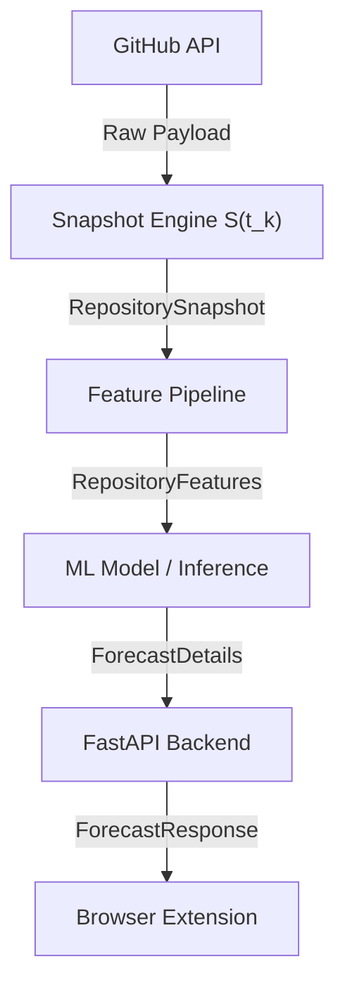
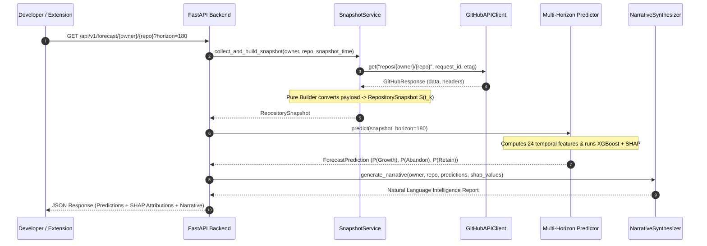
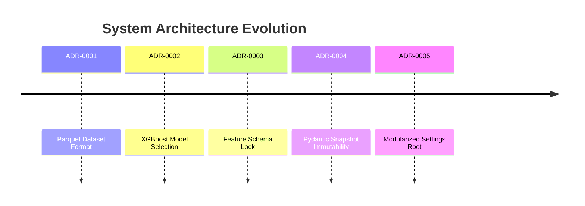

# Repository Intelligence Platform (RIP) 🚀

[](https://github.com/sharmaahetal/The_Repository_Intelligence_Platform/actions)
[](docs/performance.md)
[](pyproject.toml)
[](LICENSE)
[](CHANGELOG.md)

> **Forecasts the future evolution of GitHub repositories by learning from historical point-in-time repository snapshots, producing probabilistic predictions for growth, maintainability, and abandonment while generating an explainable, natural language Repository Intelligence Report.**

---

## 1. Project Overview

The **Repository Intelligence Platform (RIP)** solves a fundamental challenge in open-source software engineering: **predicting repository sustainability and maintenance risk before investing heavily in a software dependency.**

Rather than evaluating raw static metrics (like star count or fork count), RIP captures **point-in-time historical snapshots** $S(t_k)$ and applies calibrated ML models (XGBoost + SHAP feature attribution) to calculate multi-horizon survival probabilities and actionable natural language narratives.

---

## 2. Live Demo & OpenAPI Reference

- **Interactive Swagger / OpenAPI UI**: [http://localhost:8000/docs](http://localhost:8000/docs)
- **Health Liveness Probe**: [http://localhost:8000/api/v1/health/live](http://localhost:8000/api/v1/health/live)
- **Sample Forecast Request**:
```bash
curl -X GET "http://localhost:8000/api/v1/forecast/fastapi/fastapi?horizon=180" -H "accept: application/json"
```

---

## 3. High-Level Architecture Diagram



### End-to-End Execution Sequence Flow


---

## 4. Key Capabilities & Innovations

1. **Deterministic Historical Snapshot Engine**: Models train on point-in-time historical snapshots $S(t_k)$ rather than static repository state, avoiding lookahead bias.
2. **Multi-Horizon Probabilistic Matrix**: Explicit forecasts parameterizing outcomes over 90, 180, and 365-day prediction windows ($P(\text{Growth})$, $P(\text{Abandon})$, $P(\text{Retain})$).
3. **Derived Health Index**: Health score is a deterministic, explainable function derived from calibrated probabilistic model outputs (never used directly as a synthetic training target).
4. **Causal Temporal Leakage Guard**: Features for $S(t_k)$ are strictly restricted to data generated $\le t_k$.
5. **Explainable Narrative Synthesis Engine**: Translates raw ML probabilities and feature attributions (SHAP values) into human-readable natural language reports.
6. **Inference Monitoring & Drift Evaluator**: Logs live predictions and evaluates accuracy once observation horizons expire ($t_k + H$).
7. **Cross-Browser Extension**: Built with Manifest V3, Vite, React, and Zustand; embeds seamlessly into GitHub repository pages with SPA navigation observers.

---

## 5. Tech Stack

| Layer | Technologies & Frameworks |
|---|---|
| **Backend Service** | Python 3.12, FastAPI, Pydantic v2, Uvicorn, Asyncio |
| **ML & Data Science** | XGBoost, SHAP, PyArrow, Pandas, NumPy, Scikit-learn |
| **Browser Extension** | React 18, TypeScript, Vite, Zustand, Manifest V3 |
| **Data Storage & Cache** | PostgreSQL, Redis, Parquet Columnar Datasets |
| **DevOps & Testing** | Docker, Docker Compose, Pytest, GitHub Actions CI/CD |

---

## 6. Quick Start (5 Minutes)

Launch the full platform stack with Docker Compose:

```bash
# 1. Clone repository
git clone https://github.com/sharmaahetal/The_Repository_Intelligence_Platform.git
cd Predictive_Analytics_Pipeline

# 2. Copy environment configuration template
cp .env.example .env

# 3. Launch container stack
docker compose up --build -d

# 4. Open interactive API docs
open http://localhost:8000/docs
```

### Configuration Matrix

| Variable Name | Required | Default | Description |
|---|---|---|---|
| `APP_ENVIRONMENT` | No | `development` | Environment mode (`development`, `staging`, `production`) |
| `GITHUB_TOKEN` | Yes (in prod) | `""` | GitHub Personal Access Token for rate limits |
| `DATABASE_URL` | No | `sqlite+aiosqlite:///./data.db` | Async PostgreSQL or SQLite database URL |
| `REDIS_URL` | No | `redis://localhost:6379/0` | Redis connection URL for caching |

For full setup options, see **[docs/getting_started.md](docs/getting_started.md)**.

---

## 7. Screenshots & Visual Preview

```
┌─────────────────────────────────────────────────────────────┐
│ 📊 Repository Health Index                       85% Conf.  │
│ Model v1.0 | 180d Horizon                                   │
│                                                             │
│ 82/100                                                      │
│ Growth: 78% | Retention: 84%                                │
│                                                             │
│ [90d Horizon]  [180d Horizon]  [365d Horizon]              │
│                                                             │
│ High maintainer retention and steady issue resolution.     │
│ 🟢 Positive Drivers: Low issue closure time                 │
│ 🔴 Risk Factors: Unresolved PR backlog ratio                │
│                                                             │
│ SHAP Feature Attribution Drivers                            │
│ commit_velocity_30d       +0.42 [██████████████]            │
│ maintainer_retention_ratio +0.31 [██████████]               │
└─────────────────────────────────────────────────────────────┘
```

---

## 8. Browser Extension (Manifest V3 + React)

The browser extension embeds directly into GitHub repository pages:

```bash
cd extension
npm install
npm run build
```

**Loading in Chrome / Brave**:
1. Open `chrome://extensions/`
2. Enable **Developer mode** (top-right toggle).
3. Click **Load unpacked** and select `extension/dist/`.

---

## 9. API Documentation & OpenAPI Reference

| Method | Endpoint | Description |
|---|---|---|
| `GET` | `/api/v1/forecast/{owner}/{repo}` | Generates repository forecast report |
| `GET` | `/api/v1/health/live` | Liveness probe verifying backend process |
| `GET` | `/api/v1/health/ready` | Readiness probe checking model & DB readiness |
| `GET` | `/api/v1/health/startup` | Startup probe verifying bootstrap initialization |

---

## 10. ML Pipeline & Feature Engineering

The ML platform runs a walk-forward chronologically split cross-validation pipeline:
- **Temporal Feature Store**: Computes 24 temporal activity, growth, popularity, and maintainer features.
- **Causal Anti-Leakage Guard**: Enforces strict $t \le t_k$ temporal boundaries.
- **Model Registry**: Manages versioned model artifacts (`artifacts/registry/`) and hyperparameter experiments.

---

## 11. Documentation Index & ADR Timeline

### Documentation Index
- **[Getting Started (5 min)](docs/getting_started.md)**: Setup guide & config matrix.
- **[Developer Guide](docs/developer_guide.md)**: Local workflow & debugging.
- **[Testing Strategy](docs/testing.md)**: Pytest execution & test layout.
- **[Coding Standards](docs/coding_standards.md)**: Code style & commit rules.
- **[Release Process](docs/release_process.md)**: SemVer release policy & extension build.
- **[Secrets Management](docs/SECRETS_MANAGEMENT.md)**: Zero-secrets production security policy.
- **[Backup & Disaster Recovery](docs/BACKUP_AND_RESTORE.md)**: Backup schedules & restore runbook.
- **Operational Runbooks**:
  - [Backend Outage Runbook](docs/runbooks/backend_down.md)
  - [Database Disconnection Runbook](docs/runbooks/database_failure.md)
  - [Redis Cache Failure Runbook](docs/runbooks/redis_failure.md)

### Architectural Decision Records (ADR Timeline)



---

## 12. Roadmap

- [x] **Phase 1**: Deterministic Snapshot Engine & Temporal Feature Store
- [x] **Phase 2**: Multi-Horizon XGBoost Predictor & SHAP Explainer
- [x] **Phase 3**: Manifest V3 Browser Extension & Global Zustand Store
- [x] **Phase 4**: Production Readiness, Probes & Security Headers Middleware
- [ ] **Phase 5**: Real-Time WebHook Snapshot Ingestion Pipeline

---

## 13. Contributing & License

Contributions are welcome! Please review our **[Developer Guide](docs/developer_guide.md)** and **[Coding Standards](docs/coding_standards.md)** before submitting pull requests.

This project is licensed under the **Apache 2.0 License** - see the [LICENSE](LICENSE) file for details.
