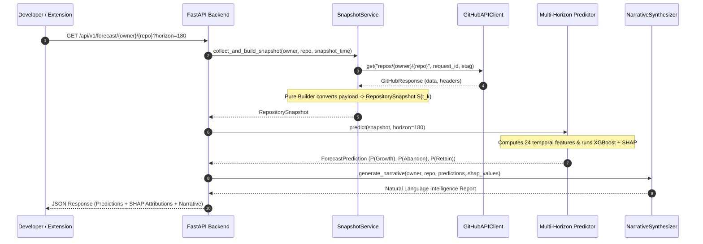

# Repository Intelligence Platform (RIP) 🚀

> **Forecasts the future evolution of GitHub repositories by learning from historical point-in-time repository snapshots, producing probabilistic predictions for growth, maintainability, and abandonment while generating an explainable, natural language Repository Intelligence Report.**

---

## 🏛️ High-Level System Architecture

The **Repository Intelligence Platform (RIP)** follows a Service-Oriented Architecture (SOA) with strict causal temporal isolation and data boundaries:

```mermaid
flowchart TD
    GH[GitHub REST API v3] -->|HTTP GET / ETag 304| Client[GitHubAPIClient]
    Client --> Collector[RepositoryCollector]
    Collector --> Validator[RawPayloadValidator]
    Validator --> RawStore[(RawPayloadRepository / PostgreSQL)]
    Validator --> Builder[SnapshotBuilder]
    Builder -->|Pure Function S(t_k)| SnapStore[(SnapshotRepository)]
    SnapStore --> FeatureStore[Temporal Feature Store Engine]
    FeatureStore --> Pipeline[Feature Pipeline]
    
    subgraph Offline ML Pipeline
        Pipeline --> LabelGen[Forward Label Generator]
        LabelGen --> Trainer[XGBoost Walk-Forward Trainer]
        Trainer --> Registry[(Versioned Model Registry)]
    end
    
    subgraph Online Service
        Registry --> Inference[Multi-Horizon Predictor Engine]
        FeatureStore --> Inference
        Inference --> ReportGen[Narrative Synthesizer Engine]
        ReportGen --> FastAPI[FastAPI REST API]
        FastAPI --> Extension[Manifest V3 Browser Extension]
    end
```

---

## 🔄 End-to-End Sequence Flow



---

## 🎯 Key Capabilities & System Innovations

1. **Deterministic Historical Snapshot Engine**: Models train on point-in-time historical snapshots $S(t_k)$ rather than static repository state, avoiding lookahead bias.
2. **Multi-Horizon Probabilistic Matrix**: Explicit forecasts parameterizing outcomes over 90, 180, and 365-day prediction windows ($P(\text{Growth})$, $P(\text{Abandon})$, $P(\text{Retain})$).
3. **Derived Health Index**: Health score is a deterministic, explainable function derived from calibrated probabilistic model outputs (never used directly as a synthetic training target).
4. **Causal Temporal Leakage Guard**: Features for $S(t_k)$ are strictly restricted to data generated $\le t_k$.
5. **Explainable Narrative Synthesis Engine**: Translates raw ML probabilities and feature attributions (SHAP values) into human-readable natural language reports.
6. **Inference Monitoring & Drift Evaluator**: Logs live predictions and evaluates accuracy once observation horizons expire ($t_k + H$).
7. **Cross-Browser Extension**: Built with Manifest V3, Vite, React, and Zustand; embeds seamlessly into GitHub repository pages with SPA navigation observers.

---

## 📁 Repository Structure

```
Predictive_Analytics_Pipeline/
├── .github/                  # GitHub Actions CI/CD workflows
├── backend/                  # FastAPI backend server
│   ├── app/
│   │   ├── api/              # HTTP routers (forecast, health, report)
│   │   ├── collectors/       # GitHub API integration, ETag & rate limit handling
│   │   ├── raw_store/        # JSON payload persistence & database repository
│   │   ├── snapshots/        # Point-in-time Snapshot Engine & Repository
│   │   ├── normalizers/      # Raw payload -> relational schema converter
│   │   ├── features/         # Temporal Feature Store Engine
│   │   ├── narrative/        # Natural Language Synthesis Engine
│   │   ├── services/         # Intelligence Report Generator Service
│   │   ├── monitoring/       # Drift, Accuracy Tracking & Benchmarking
│   │   ├── database/         # Async PostgreSQL & Redis connections
│   │   ├── config/           # Modularized environment settings
│   │   └── main.py           # FastAPI entrypoint
├── datasets/                 # Dataset & Label Generation Service
│   ├── label_generator.py    # Forward observation window labeler
│   └── leakage_guard.py      # Causal temporal leakage assertions
├── ml/                       # Machine Learning Pipeline
│   ├── training/             # XGBoost model trainers
│   ├── inference/            # Multi-horizon inference predictor
│   └── registry/             # Versioned Model Registry
├── extension/                # Browser Extension (Manifest V3 + React + Zustand)
├── research/                 # Problem formulation & evaluation protocols
├── docs/                     # Architecture, Performance & Deployment Guides
│   ├── adr/                  # Architectural Decision Records Index
│   ├── historical_snapshot_engine.md
│   ├── performance.md
│   └── deployment.md
└── tests/                    # 100% passing unit & integration test suite
```

---

## 🛠️ Quick Start & Local Setup

### 1. Prerequisites
- **Python**: 3.11+
- **Node.js**: 18+
- **Docker & Docker Compose**: (Optional, for containerized execution)

### 2. Local Backend Setup
```bash
git clone git@github.com:sharmaahetal/The_Repository_Intelligence_Platform.git
cd Predictive_Analytics_Pipeline

# Create and activate virtual environment
python3 -m venv .venv
source .venv/bin/activate

# Install dependencies & run tests
pip install -e .
pytest

# Start FastAPI backend server
uvicorn backend.app.main:app --reload --port 8000
```

- **OpenAPI / Swagger Reference**: [http://localhost:8000/docs](http://localhost:8000/docs)
- **Health Live Probe**: [http://localhost:8000/api/v1/health/live](http://localhost:8000/api/v1/health/live)

### 3. Containerized Setup via Docker
```bash
docker-compose up --build
```

---

## 📚 Architectural Decision Records (ADR Index)

Key architectural decisions documented under [`docs/adr/`](docs/adr/README.md):

| ADR | Title | Status | Rationale |
| :--- | :--- | :---: | :--- |
| **[ADR-0001](docs/adr/0001-parquet-dataset-format.md)** | Parquet Dataset Storage Format | **Accepted** | Columnar compression and zero-copy PyArrow integration. |
| **[ADR-0002](docs/adr/0002-xgboost-over-lightgbm.md)** | XGBoost Model Selection | **Accepted** | Native SHAP tree explainer integration and sparse tabular performance. |
| **[ADR-0003](docs/adr/0003-feature-schema-versioning.md)** | Feature Schema Versioning | **Accepted** | Strict integer schema versioning to prevent dimension mismatch. |
| **[ADR-0004](docs/adr/0004-pydantic-domain-models.md)** | Pydantic Snapshot Immutability | **Accepted** | Frozen Pydantic models enforcing temporal anti-leakage guards. |

---

## 🚀 Deployment & Operations

For deployment instructions across FastAPI (Railway / Render / Fly.io), Neon PostgreSQL, Upstash Redis, Cloudflare R2, and Chrome Web Store V3 publishing, refer to **[docs/deployment.md](docs/deployment.md)**.
