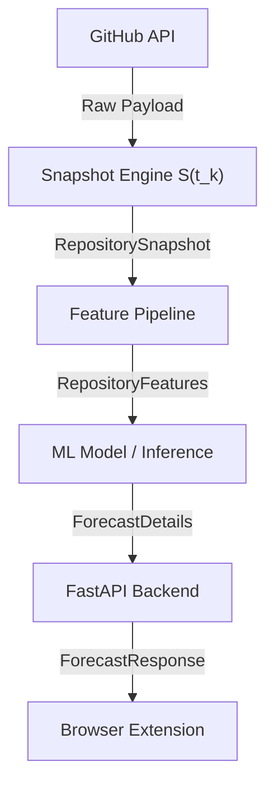
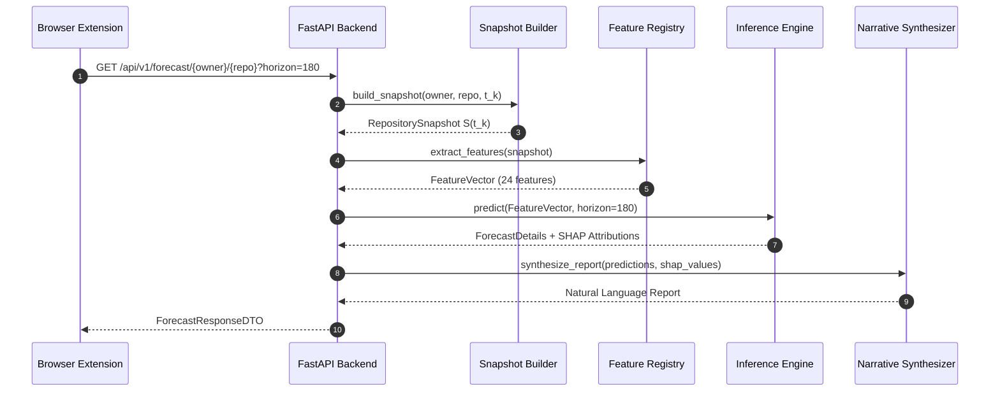
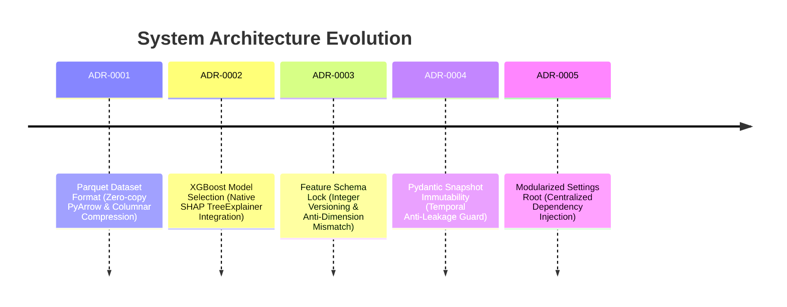

# System Architecture Specification 🏛️

## 1. High-Level Architecture (20-Second Overview)

---

## 2. End-to-End Sequence Diagram

---

## 3. Failure Mode & Recovery Matrix

| Component | Failure Scenario | System Handling / Degradation | Recovery Procedure |
|---|---|---|---|
| **GitHub API** | 503 / Rate Limit / Timeout | CircuitBreaker opens, fast-failing; fallback to cached snapshot | Automatic retry with exponential backoff & jitter |
| **Redis Cache** | Connection Refused | Transparent fallback to snapshot builder & direct DB evaluation | Automatic reconnection on next operation |
| **PostgreSQL DB** | OperationalError / Disconnect | Readiness probe returns `"degraded"`, API raises HTTP 503 | Auto-restart via Docker / Connection pool reconnect |
| **Model Registry** | Model Artifact Missing | Fallbacks to default baseline heuristic predictor | Model reload via `/health/ready` initialization |

---

## 4. Architectural Decision Records (ADR Timeline)

| ADR | Title | Status | Impact |
| :--- | :--- | :---: | :--- |
| **[ADR-0001](adr/0001-parquet-dataset-format.md)** | Parquet Dataset Storage Format | **Accepted** | Columnar compression & zero-copy PyArrow integration. |
| **[ADR-0002](adr/0002-xgboost-over-lightgbm.md)** | XGBoost Model Selection | **Accepted** | Native SHAP tree explainer integration. |
| **[ADR-0003](adr/0003-feature-schema-versioning.md)** | Feature Schema Versioning | **Accepted** | Integer schema lock preventing vector mismatch. |
| **[ADR-0004](adr/0004-pydantic-domain-models.md)** | Pydantic Snapshot Immutability | **Accepted** | Strict temporal anti-leakage guards. |
| **ADR-0005** | Modularized Settings Root | **Accepted** | Single root configuration & provider DI. |
