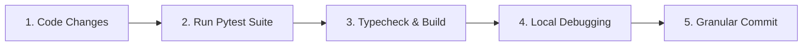

# Developer Guide & Local Workflow 🛠️

This document outlines the standard development workflow for contributors modifying the **Repository Intelligence Platform (RIP)**.

---

## 🔄 Daily Development Loop



### 1. Backend Development Loop
1. Activate virtual environment: `source .venv/bin/activate`
2. Make code edits in `backend/app/` or `ml/` or `datasets/`.
3. Execute unit tests:
   ```bash
   pytest tests/backend/test_your_feature.py
   ```
4. Run full test suite:
   ```bash
   pytest
   ```

### 2. Extension Development Loop
1. Navigate to `extension/` directory: `cd extension`
2. Run TypeScript compiler watch mode:
   ```bash
   npm run watch
   ```
3. Reload extension in `chrome://extensions/` by clicking the reload icon on the unpacked extension card.

---

## 🐛 Local Debugging Strategies

### 1. Backend Log Inspection
The backend uses structured JSON logging with request correlation IDs. View formatted development logs:
```bash
uvicorn backend.app.main:app --reload --log-level debug
```

Inspect context parameters in log output:
- `request_id`: Traces individual API requests across processing stages.
- `repository`: Current GitHub repository being processed.

### 2. Extension Background Service Worker Inspection
1. Open `chrome://extensions/`
2. Locate **Repository Intelligence Platform** extension card.
3. Click `Inspect views: service worker` link to open DevTools console for the background script.

---

## 📦 Conventional Commit Guidelines

Every commit must follow strict conventional commit formatting:

```
<type>(<scope>): <short summary>

[optional body]
```

### Allowed Types:
- `feat`: New feature or capability
- `fix`: Bug fix or patch
- `refactor`: Structural code improvement without functional change
- `test`: Adding or modifying tests
- `docs`: Documentation updates
- `chore`: Dependency updates, build configs, CI pipelines

### Examples:
- `feat(snapshots): implement deterministic snapshot_id derivation`
- `fix(collectors): handle HTTP 304 ETag responses correctly`
- `test(ml): add walk-forward cross-validation assertion`
