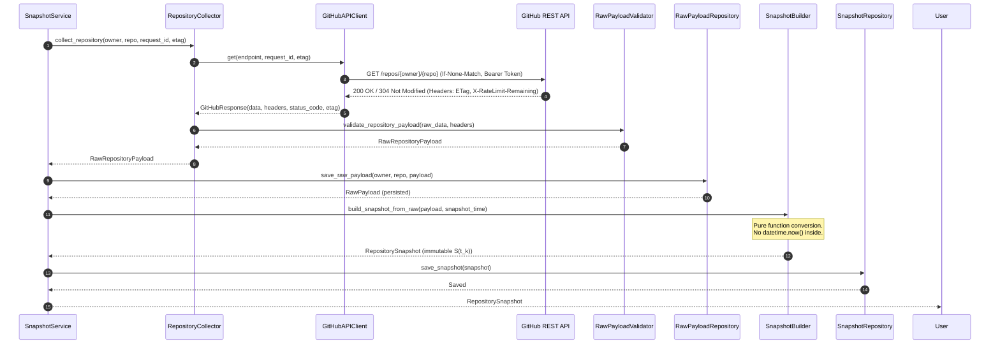

# Historical Snapshot Engine Architecture — Phase 1 Documentation

## 1. Subsystem Architecture Overview

The **Historical Snapshot Engine** is responsible for collecting raw repository data from GitHub REST API v3, validating response structures, persisting raw payloads alongside HTTP metadata, and constructing deterministic point-in-time domain snapshots $S(t_k)$.

```
GitHub API (REST v3)
        │
        ▼
GitHubAPIClient (Persistent httpx.AsyncClient connection pool, ETag headers, rate-limit reset wait)
        │
        ▼
RepositoryCollector (Pure orchestration: fetches raw response payload via client and passes to validator)
        │
        ▼
RawPayloadValidator (Validates response dict -> RawRepositoryPayload, rejects missing fields/invalid IDs)
        │
        ▼
RawPayloadRepository (Persists raw payloads, headers, ETags, and fetch timestamps to raw_payload_store)
        │
        ▼
SnapshotBuilder (Pure function engine: RawRepositoryPayload + snapshot_time -> RepositorySnapshot)
        │
        ▼
RepositorySnapshot (Immutable, validated Pydantic model with UTC timestamps & schema version)
        │
        ▼
SnapshotRepository (Data Access Layer persisting RepositorySnapshot domain entities)
```

---

## 2. Sequence Diagram



---

## 3. Retry Strategy & Backoff Algorithm

The engine uses exponential backoff with full jitter to handle transient network glitches and server outages.

### **Retry Rules**:
1. **Retryable Status Codes**: `500` Internal Server Error, `502` Bad Gateway, `503` Service Unavailable, `504` Gateway Timeout, and `429` Too Many Requests.
2. **Non-Retryable Errors**: `401` Unauthorized, `403` Forbidden (unless rate-limited), `404` Not Found, `422` Unprocessable Entity.
3. **Backoff Formula**:
   $$\text{delay} = \min\left(\text{base\_delay}^{\text{attempt}} + \text{uniform}(0.1, 1.0), \; \text{max\_delay}\right)$$
   where $\text{base\_delay} = 2.0\text{s}$ and $\text{max\_delay} = 60.0\text{s}$.

---

## 4. Rate-Limit Handling Strategy

GitHub API enforces strict rate limits ($5,000$ requests/hour for authenticated users).

### **Handling Mechanism**:
- Every request inspects `X-RateLimit-Remaining`, `X-RateLimit-Reset`, and `Retry-After` headers.
- **HTTP 429 / Retry-After**: If GitHub returns a `Retry-After` header, the client automatically pauses execution for the requested number of seconds before attempting the retry.
- **Rate Limit Depletion ($X\text{-RateLimit-Remaining} = 0$)**: If remaining quota reaches zero, `calculate_rate_limit_sleep` computes:
  $$\text{sleep\_seconds} = (\text{X-RateLimit-Reset} - \text{time.now()}) + 1\text{s buffer}$$
  The client pauses execution until the reset window opens and then resumes cleanly.

---

## 5. ETag Flow (HTTP 304 Not Modified)

To maximize rate limit efficiency and support change detection, the engine uses HTTP ETags:

1. **Initial Collection**: Store response `ETag` (e.g. `W/"61b4d00..."`) in `RawPayloadRepository`.
2. **Subsequent Request**: Pass `etag` parameter into `GitHubAPIClient.get(...)`. Client sets `If-None-Match: W/"61b4d00..."`.
3. **Response Handling**:
   - If payload changed $\rightarrow$ GitHub returns `200 OK` + new body + new `ETag`.
   - If payload unchanged $\rightarrow$ GitHub returns `304 Not Modified`. Client returns `GitHubResponse(status_code=304, data={})` avoiding payload download and preserving rate limits.

---

## 6. Snapshot Schema & Immutability

The `RepositorySnapshot` model represents point-in-time repository state $S(t_k)$.

| Field | Type | Description |
| :--- | :--- | :--- |
| `schema_version` | `int` | Schema version (default: `1`, frozen) |
| `repository_id` | `int` | GitHub integer repository ID |
| `owner` | `str` | Repository owner handle |
| `name` | `str` | Repository name |
| `stars` | `int` | Stargazer count ($\ge 0$) |
| `forks` | `int` | Fork count ($\ge 0$) |
| `watchers` | `int` | Subscriber/watcher count ($\ge 0$) |
| `issues` | `int` | Open issue count ($\ge 0$) |
| `language` | `str` | Primary programming language |
| `license` | `str \| None` | License SPDX identifier (e.g., `"MIT"`) |
| `created_at` | `datetime` | Creation timestamp (UTC) |
| `updated_at` | `datetime` | Update timestamp (UTC) |
| `snapshot_time` | `datetime` | Point-in-time snapshot timestamp $t_k$ (UTC) |

### **Immutability Requirement**:
- Model configuration sets `model_config = ConfigDict(frozen=True)`.
- Attempting to modify any field post-instantiation raises `pydantic.ValidationError`.

---

## 7. Failure Modes & Recovery

| Failure Mode | Root Cause | System Response |
| :--- | :--- | :--- |
| `RateLimitExceeded` | API quota depleted | Pauses execution until `X-RateLimit-Reset` timestamp |
| `5xx Server Error` | Transient GitHub outage | Retries up to 3 times with exponential backoff & jitter |
| `ValidationError` | Missing mandatory fields (`name`/`owner`) | Rejects payload immediately, logs error extra details |
| `InvalidTimestampError` | Naive datetime passed | `SnapshotBuilder` rejects naive timestamps; forces UTC timezone |
